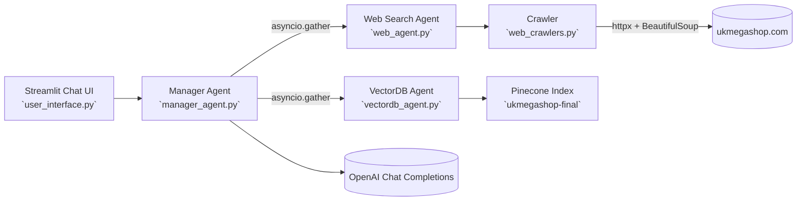

## UK Mega Shop Support Agents (Web + VectorDB) with Streamlit UI

An end-to-end, multi‑agent customer support assistant for `ukmegashop.com`. It combines:

- Web Search Agent: crawls selected site pages on demand and extracts clean text
- VectorDB Agent: retrieves relevant context from a Pinecone index
- Manager Agent: synthesizes both agents’ answers into one concise reply
- Streamlit UI: a lightweight chat interface for interactive Q&A


### Features
- **Dual-sourcing answers**: live web crawling + vector database retrieval
- **Concurrent execution**: both agents run in parallel for speed
- **Tool calling**: the web agent decides which URLs to crawl (always includes the FAQ)
- **Clean extraction**: boilerplate and non-text elements are removed from HTML
- **Simple UI**: Streamlit chat with session history


### Architecture



### Project structure
```
stream/
  manager_agent.py      # Orchestrates web + vectordb agents, merges answers with OpenAI
  prompts.py            # System prompts for manager and web agent
  user_interface.py     # Streamlit chat app
  vectordb_agent.py     # Pinecone retrieval using OpenAI embeddings
  web_agent.py          # Web agent with tool-calling to crawl URLs
  web_crawlers.py       # Async HTML fetch + text extraction (httpx + BeautifulSoup)
  requirements.txt      # Python dependencies
```


### Requirements
- Python 3.10+
- OpenAI API key (`OPENAI_API_KEY`)
- Pinecone API key (`PINECONE_API_KEY`) if you want VectorDB retrieval


### Quickstart
1) Clone and enter the project directory
```bash
git clone <your-repo-url>
cd stream
```

2) Create and activate a virtual environment (recommended)
```bash
# Windows (PowerShell)
python -m venv .venv
.\.venv\Scripts\Activate.ps1

# macOS/Linux
python3 -m venv .venv
source .venv/bin/activate
```

3) Install dependencies
```bash
pip install -r requirements.txt
```

4) Set environment variables
```powershell
# Windows PowerShell
$env:OPENAI_API_KEY = "sk-..."
$env:PINECONE_API_KEY = "pcn-..."   # required for VectorDB agent
```
```bash
# macOS/Linux
export OPENAI_API_KEY="sk-..."
export PINECONE_API_KEY="pcn-..."   # required for VectorDB agent
```

5) Prepare Pinecone (for the VectorDB agent)
- Create an index named `ukmegashop-final` with dimension 1536 (OpenAI `text-embedding-3-small`) and cosine metric.
- You can do this in the Pinecone console or via code:
```python
from pinecone import Pinecone
pc = Pinecone(api_key="<PINECONE_API_KEY>")
pc.create_index(name="ukmegashop-final", dimension=1536, metric="cosine")
```

Seed the index with your content (not included in this repo). Example sketch:
```python
from pinecone import Pinecone
from openai import OpenAI

pc = Pinecone(api_key="<PINECONE_API_KEY>")
index = pc.Index("ukmegashop-final")

oai = OpenAI(api_key="<OPENAI_API_KEY>")
texts = ["Return policy...", "Shipping info...", "Warranty details..."]
embs = oai.embeddings.create(input=texts, model="text-embedding-3-small").data
vectors = [
  {"id": f"doc-{i}", "values": e.embedding, "metadata": {"text": t}}
  for i, (t, e) in enumerate(zip(texts, embs))
]
index.upsert(vectors=vectors)
```

6) Run the app
```bash
streamlit run user_interface.py
```


### How it works
- **Web agent (`web_agent.py`)**
  - Holds a curated list of `ukmegashop.com` URLs and a system prompt that always forces crawling the FAQ page.
  - Uses OpenAI tool-calling to select URLs; the code then crawls them asynchronously with `crawler()` and feeds extracted text back to the model (`gpt-4o`).

- **Crawler (`web_crawlers.py`)**
  - Fetches pages concurrently with `httpx.AsyncClient`.
  - Parses HTML using `BeautifulSoup(lxml)` and removes non-content tags (scripts, styles, nav, etc.) before returning clean text.

- **VectorDB agent (`vectordb_agent.py`)**
  - Creates embeddings with `text-embedding-3-small` and queries the Pinecone index `ukmegashop-final` for top-k matches.
  - Sends the retrieved context to an OpenAI chat model (`gpt-4.1`) to craft an answer.

- **Manager agent (`manager_agent.py`)**
  - Runs both agents concurrently (`asyncio.gather`).
  - Uses a manager prompt to synthesize a single, concise response from both answers via OpenAI (`gpt-4.1`).

- **UI (`user_interface.py`)**
  - Streamlit chat with simple session history. Type your question and receive an answer sourced from web + vector DB.


### Configuration and customization
- **Change target site/URLs**: edit `urls` in `web_agent.py` and adjust wording in `web_agent_ki_prompt` within `prompts.py`.
- **Change models**: update model names in `web_agent.py`, `vectordb_agent.py`, and `manager_agent.py`.
- **Change Pinecone index**: update the index name in `vectordb_agent.py` and ensure embedding dimension matches your chosen model.
- **Timeouts / headers**: tweak `httpx` settings or user agent in `web_crawlers.py`.


### Security, usage, and costs
- Keep API keys secret; prefer environment variables or a secrets manager.
- Each chat and crawl incurs OpenAI token usage; web requests are external network calls.
- Respect target site’s Terms of Service and robots.txt. Consider adding rate limits and backoff if crawling many pages.


### Troubleshooting
- "OpenAI key not set" or auth errors: ensure `OPENAI_API_KEY` is exported in the same shell session running Streamlit.
- Pinecone errors (index not found/dimension mismatch): create `ukmegashop-final` with dimension 1536, or update the index name/dimension in code.
- Empty/weak answers from VectorDB: your index likely has no data; upsert content first.
- HTTP errors while crawling: the site may block or rate-limit; adjust headers, timeouts, or reduce concurrency.
- SSL/Proxy issues: configure system trust store or `httpx` client settings to match your environment.


### Roadmap ideas
- Ingestion pipeline to auto-populate Pinecone from the same crawler
- Cache crawled pages to reduce latency and cost
- Add source citations and confidence scores in the final answer
- Support multi-tenant sites and dynamic URL discovery


### License
No license specified. Add a `LICENSE` file if you plan to distribute.


